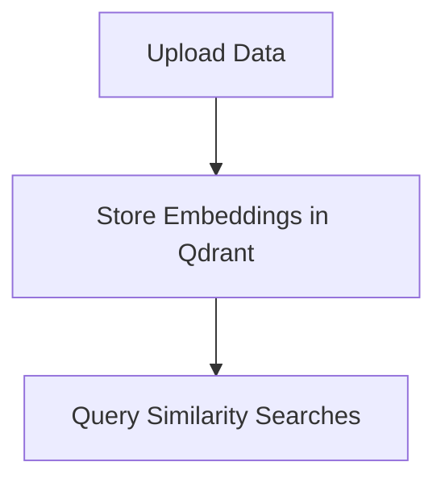

# Assistant Chatbot

An intelligent chatbot powered by large language models (LLM), enabling users to interact with a wide variety of data sources for precise, real-time responses using Retrieval-Augmented Generation (RAG) techniques.

## Gráfico del Pipeline

## Documentation

- Create your chatbot assistant [Medium](https://medium.com/@milistu/create-your-chatbot-assistant-928daa8d6b46)

## Overview

The Assistant Chatbot integrates several components:

- **Scraper**: Collects necessary data to build the database and power the RAG system.
- **Vector Database**: Stores embedded text data for fast, high-accuracy similarity searches.
- **Semantic Router**: Routes user queries to the most relevant data collections, improving response relevance.
- **Large Language Model (LLM)**: Provides intelligent, context-aware responses to user queries.
- **User Interface (UI)**: A Streamlit-powered, user-friendly interface for chatbot interactions.
- **Deployment**: Hosts the chatbot using Streamlit Sharing, making it accessible to users.
- **Tracking & Evaluation**: Monitors and evaluates chatbot performance for continuous improvement.

## What is RAG?

Retrieval-Augmented Generation (RAG) combines LLM-generated responses with retrieved, contextually relevant information from external sources like vector databases, improving accuracy and relevance.

## RAG del Pipeline

[Medium Article Link](https://medium.com/intel-tech/improve-your-tabular-data-ingestion-for-rag-with-reranking-bebcf52cdde3)
[Reranking](https://www.pinecone.io/learn/series/rag/rerankers/)
## Steps to Create the Chatbot:

### 1.1 [Scraper](https://bitbucket.org/sdggroup/inno-dashboard-assistant-2024/raw/main/Data_Extraction)

### 1.2 [Data Estructuring](https://bitbucket.org/sdggroup/inno-dashboard-assistant-2024/raw/main/Data_Transformation\OpenAI_API\Data_Structuring)

### 2. Vector Database

The vector database stores embeddings that represent textual data in a high-dimensional space, allowing fast similarity searches for relevant data.

#### Process:
- **Chunking Data**: Break the data into smaller parts.
- **Embedding Data**: Convert text into numerical vectors (embeddings).
- **Upload to Vector Database**: Store embeddings in the vector database, e.g., Qdrant.

### 3. Semantic Query Router
Directs user queries to the relevant data collections based on query content, optimizing the search process by minimizing irrelevant responses.

[Rerank -> FlashRank](https://github.com/PrithivirajDamodaran/FlashRank?tab=readme-ov-file) 

### 4. Large Language Model (LLM)

The brain of the chatbot system, responsible for understanding user queries, retrieving context, and generating responses based on the retrieved information.

- **User Query**: Query is routed to the relevant data collections.
- **Retrieve Context**: Similar documents are retrieved from the vector database.
- **Generate Response**: The context is passed to the LLM for generating a user-friendly response.

### 5. User Interface

The chatbot interface is built using Streamlit, enabling easy interaction with users.

#### Key Components:
- **Session Management**: Manages chat history to provide context for ongoing conversations.
- **Streamlit Setup**: Configures page settings, sidebars, and client initializations for OpenAI and Qdrant.

### 6. Deployment

### 7. Tracking and Evaluation

Track user interactions and analyze chatbot performance using tools like Langfuse. It helps trace and evaluate model calls, debug responses, and monitor key performance metrics.

## Conclusion

This chatbot assistant integrates cutting-edge components like vector databases, LLM, and semantic query routing to provide accurate and context-aware responses. With easy deployment through Streamlit and tracking with Langfuse, this chatbot is scalable, efficient, and user-friendly.

## References

- [NVIDIA Blog on RAG](https://developer.nvidia.com/bl
- [Pinecone Vector Database](https://www.pinecone.io/)
- [Langfuse Open Source](https://www.langfuse.com/)