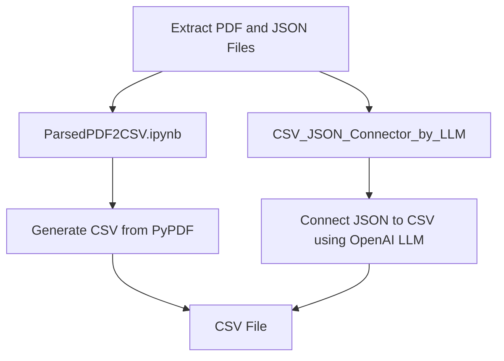

# Data Transformation

## Overview


## Option 1.1: OpenAI LLM Approach for Data Transformation

This option describes the process of extracting tables from Power BI dashboards that have been exported as unstructured text in PDFs. The extraction is done using OpenAI's LLM API, which processes the text and identifies tables.




Following the **Data_Extraction_Web_Scraping_Option_1.4** branch, this process involves extracting content from PDF and JSON files.

- **Scripts**:
  - **ParsedPDF2CSV.ipynb**:  
    This script uses the OpenAI API to create a CSV from text extracted using PyPDF.
  
  - **CSV_JSON_Connector_by_LLM**:  
    In this commit, we also introduce a script designed to create a connector between JSON and CSV tables using OpenAI LLM.

### Execution Steps:

- **Power BI Scraper**:  
  Execute the following command using PowerShell to intercept Power BI requests:  
  ```pwsh
  mitmdump -s mitm_scr_2.py "~h X-PowerBI"
  ```

- **Run Selenium Workflow**:  
  Use the following command to run the scraping workflow:
  ```bash
  python run Selenium_1_4.ipynb
  ```

- **Convert PDF to CSV**:  
  Run the script `ParsedPDF2CSV.ipynb`, which utilizes the OpenAI API to extract text from a PDF generated with PyPDF and transform it into a CSV format.

- **JSON to CSV Connector**:  
  Another script, `CSV_JSON_Connector_by_LLM`, has been created in this commit to process JSON files and transform them into CSV tables using OpenAI LLM.

---
### Scripts Overview:

1. **ParsedPDF2CSV.ipynb**:
   - **Objective**: Extract and convert text data from PDFs into CSV files.
   - **Tools**: PyPDF for text extraction, OpenAI API for CSV generation.

2. **CSV_JSON_Connector_by_LLM**:
   - **Objective**: Create a connector that transforms JSON data into CSV tables.
   - **Tools**: OpenAI LLM for structuring JSON data into CSV format.

### Summary:

The **Data Transformation** process leverages OpenAI's LLM to extract structured data from unstructured text (PDFs and JSONs) and transform it into CSV files. The process is designed to integrate seamlessly with Power BI dashboards and their exported reports.

### Sources:
    - [Langchain PyPDF doc](https://python.langchain.com/v0.2/docs/how_to/document_loader_pdf/) 
    - [Extraction modes]((https://pypdf.readthedocs.io/en/stable/modules/PageObject.html) 
    - [Extraction modes](https://api.python.langchain.com/en/latest/document_loaders/langchain_community.document_loaders.pdf.PyPDFLoader.html)
    - [Lancgchain JSON Parser] (https://python.langchain.com/v0.2/docs/integrations/document_loaders/json/)
    - [Lancgchain JSON Loader] (https://python.langchain.com/v0.2/api_reference/community/document_loaders/langchain_community.document_loaders.json_loader.JSONLoader.html)
    - [OpenAI LLM model token in/out](https://platform.openai.com/docs/models/gpt-4-turbo-and-gpt-4)
    - [OpenAI LLM pricing](https://openai.com/api/pricing/)


