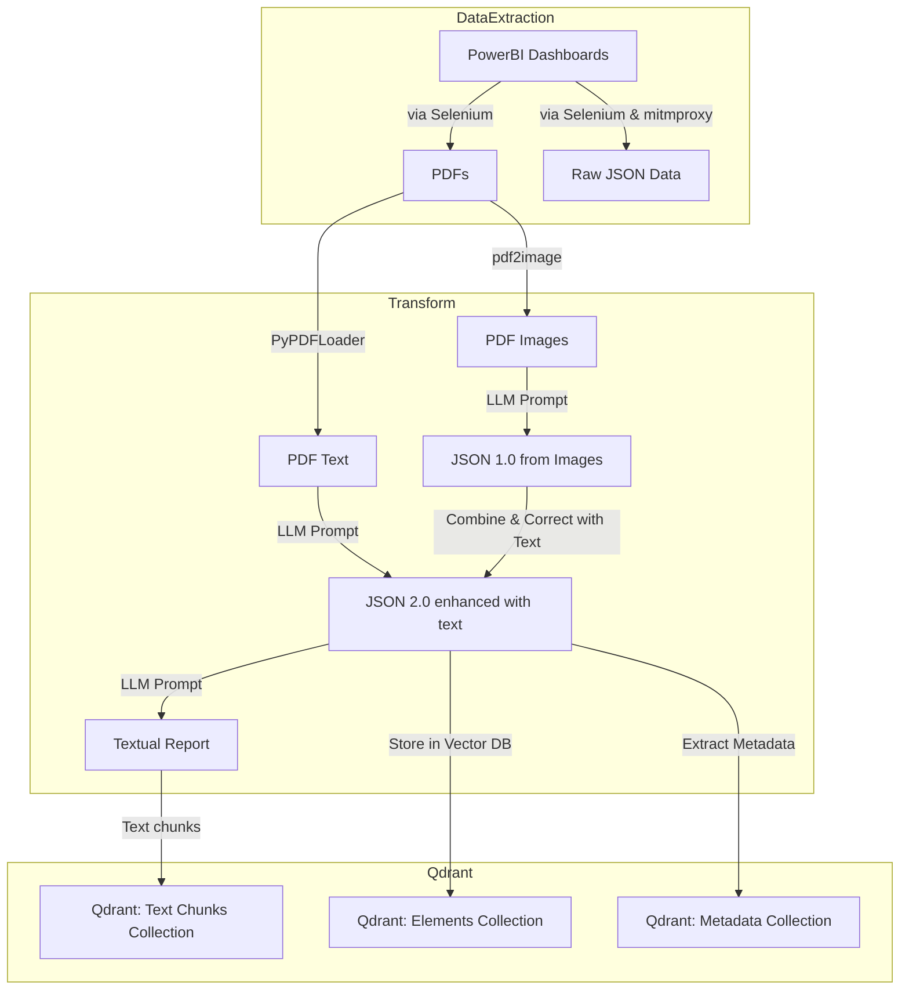

```mermaid
graph 

    C[PowerBI Dashboards]
    
    subgraph DataExtraction
        C -->|via Selenium| D[PDFs]
        C -->|via Selenium & mitmproxy| E[Raw JSON Data]
    end
    
    subgraph Transform
        D -->|pdf2image| G1[PDF Images]
        D -->|PyPDFLoader| G2[PDF Text]
        
        G1 -->|LLM Prompt| H1[JSON 1.0 from Images]
        G2 -->|LLM Prompt| I[JSON 2.0 enhanced with text]
        
        H1 -->|Combine & Correct with Text| I
   
    
    I -->|LLM Prompt| J[Textual Report]
     end
    J -->|Text chunks| J3[Qdrant: Text Chunks Collection]
    I -->|Store in Vector DB| J1[Qdrant: Elements Collection]
    I -->|Extract Metadata| J2[Qdrant: Metadata Collection]

    subgraph Qdrant
        J1
        J2
        J3
    end

```